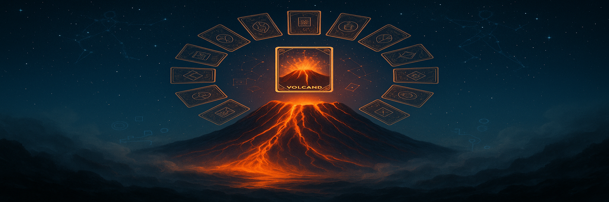

 
 

 
 
 >"Everything Is Alive on Planet Struggle."

The Toro Deck is a mythic, symbolic card system — part oracle, part game, part sacred technology. Each card represents an archetype in the great story of life’s struggle and transformation. The deck is alive, poetic,a and open to all.

This project is a spiritual-artistic collaboration unfolding in real time. You are invited.

---

🌱 Get Started

🔮 Try a Daily Card Pull via Telegram bot (coming soon)

📚 Read the Whitepaper-lite

✍️ Contribute your own card or lore: see CONTRIBUTING.md

---

💎 Tiers of Access

Free Tier: Daily pulls, core card meanings, community prompts

Keeper Tier: Extended pulls, voice meditations, vault access

Scribe Tier: Lore canonization, card generation, print access

Full details: Whitepaper-lite

---

🧙 Join the House of Yes

We are building a sanctuary for symbolic co-creation, spiritual play, and collective fire. Keepers, scribes, builders, and artists welcome.

Join us on our pilgrimage to awaken the deck. The volcano is dreaming.

🔗 Landing Page Copy

🔗 Contribution Guidelines

📬 Contact: house.of.y3s@gmail.com

---

Blessings and fire,
The Keepers of the Deck
